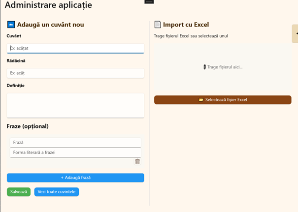
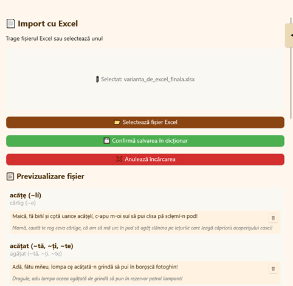
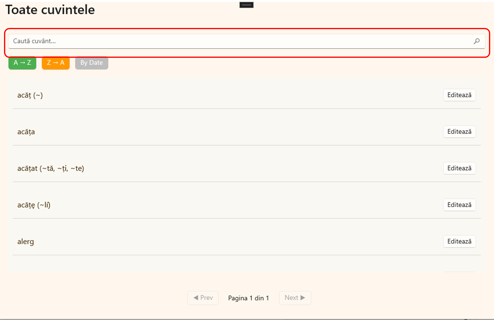
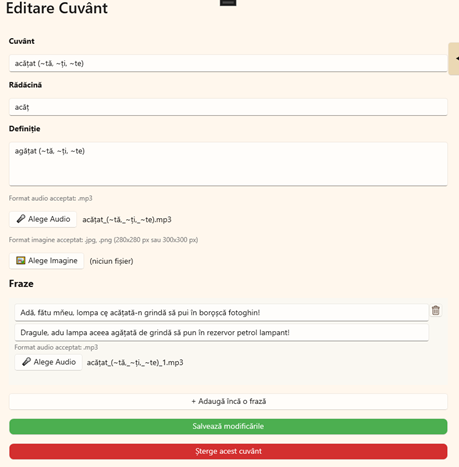

## Audio Dictionary App for Romanian Regionalisms
## About the Project  
This project is a **cross-platform dictionary system** developed as part of my diploma thesis at the Technical University of Cluj-Napoca.  
The application focuses on two main goals:  

- **Supporting language learning** through an intuitive, user-friendly mobile interface.  
- **Preserving cultural and linguistic heritage** by documenting and providing authentic pronunciation of regionalisms.  

The system is divided into two main applications:  

- **Mobile App (for end users):** Explore words, definitions, contextual phrases, and listen to authentic audio recordings.  
- **Desktop App (for administrators):** Manage dictionary content, import data from Excel files, edit entries, and ensure secure handling of resources.  

## Technologies Used  

- **Backend:**  
  - Spring Boot (Java)  
  - RESTful APIs  
  - MySQL  
  - JPA / Hibernate  

- **Frontend Mobile:**  
  - .NET MAUI (C#, XAML)  

- **Frontend Desktop:**  
  - .NET MAUI (C#, XAML)  

- **Media Support:**  
  - MP3 audio storage and playback  

- **Data Import:**  
  - Excel file handling with Apache POI  

- **Security:**  
  - File validation  
  - Excel formula injection protection  
  - JWT authentication  

---

## Architecture  

The project follows a **client–server architecture**:  

- **Backend (Spring Boot):**  
  - Exposes REST APIs for word management, media streaming, and Excel import  
  - Handles validation, storage, and business logic  

- **Frontend (.NET MAUI):**  
  - **Mobile app (end users):** Designed for learners to search, explore, and listen to word pronunciations  
  - **Desktop app (administrators):** Designed for CRUD operations, bulk imports, and validation  

## Key Features  

- 🔎 **Search & Explore**: Words, definitions, contextual phrases with diacritic support  
- 🔊 **Audio Playback**: Authentic pronunciation for regionalisms and standard words  
- 📱 **Mobile Interface**: Cross-platform UI for Android/iOS/Windows  
- 💻 **Desktop Interface**: Full control panel for administrators  
- 📂 **Excel Import**: Secure and validated bulk data import  
- 🛡️ **Security Features**: File validation, prevention of formula injection, JWT-based authentication  
- 🔤 **Special Characters Toolbar (desktop):** Quick insertion of language-specific characters  

## Screenshots  

### Mobile App (End Users)  

- **Loading Screen**  
    

- **Main Page**  
    

- **Word Details Page**  
    

### Desktop App (Administrators)  

- **Main Page**  
    

- **Excel Import**  
    

- **Search Page**  
    

- **Edit Page**  
    

